# [📈 Live Status](https://gelokatil.github.io/upptime-ceu): <!--live status--> **🟧 Partial outage**

This repository contains the open-source uptime monitor and status page for [Gelo](https://gelokatil.github.io/upptime-ceu), powered by [Upptime](https://github.com/upptime/upptime).

With [Upptime](https://upptime.js.org), you can get your own unlimited and free uptime monitor and status page, powered entirely by a GitHub repository. We use [Issues](https://github.com/gelokatil/upptime-ceu/issues) as incident reports, [Actions](https://github.com/gelokatil/upptime-ceu/actions) as uptime monitors, and [Pages](https://gelokatil.github.io/upptime-ceu) for the status page.

<!--start: status pages-->
<!-- This summary is generated by Upptime (https://github.com/upptime/upptime) -->
<!-- Do not edit this manually, your changes will be overwritten -->
<!-- prettier-ignore -->
| URL | Status | History | Response Time | Uptime |
| --- | ------ | ------- | ------------- | ------ |
|  [www.ceu.es](https://www.ceu.es) | 🟩 Up | [www-ceu-es.yml](https://github.com/gelokatil/upptime-ceu/commits/HEAD/history/www-ceu-es.yml) | 

 2388ms
     
 | 

<a href="https://gelokatil.github.io/upptime-ceu/history/www-ceu-es">100.00%</a>
    

|  [www.uchceu.es](https://www.uchceu.es) | 🟩 Up | [www-uchceu-es.yml](https://github.com/gelokatil/upptime-ceu/commits/HEAD/history/www-uchceu-es.yml) | 

 1166ms
     
 | 

<a href="https://gelokatil.github.io/upptime-ceu/history/www-uchceu-es">99.38%</a>
    

|  [www.uaoceu.es](www.uaoceu.es) | 🟩 Up | [www-uaoceu-es.yml](https://github.com/gelokatil/upptime-ceu/commits/HEAD/history/www-uaoceu-es.yml) | 

 1346ms
     
 | 

<a href="https://gelokatil.github.io/upptime-ceu/history/www-uaoceu-es">100.00%</a>
    

|  [eduroam.ceu.es](https://eduroam.ceu.es) | 🟩 Up | [eduroam-ceu-es.yml](https://github.com/gelokatil/upptime-ceu/commits/HEAD/history/eduroam-ceu-es.yml) | 

 1303ms
     
 | 

<a href="https://gelokatil.github.io/upptime-ceu/history/eduroam-ceu-es">100.00%</a>
    

|  [www.ceuuniversities.com](https://www.ceuuniversities.com) | 🟩 Up | [www-ceuuniversities-com.yml](https://github.com/gelokatil/upptime-ceu/commits/HEAD/history/www-ceuuniversities-com.yml) | 

 481ms
     
 | 

<a href="https://gelokatil.github.io/upptime-ceu/history/www-ceuuniversities-com">100.00%</a>
    

|  [www.isepceu.es](https://www.isepceu.es) | 🟩 Up | [www-isepceu-es.yml](https://github.com/gelokatil/upptime-ceu/commits/HEAD/history/www-isepceu-es.yml) | 

 591ms
     
 | 

<a href="https://gelokatil.github.io/upptime-ceu/history/www-isepceu-es">100.00%</a>
    

|  [www.escueladoctorado.ceu.es](https://www.escueladoctorado.ceu.es) | 🟩 Up | [www-escueladoctorado-ceu-es.yml](https://github.com/gelokatil/upptime-ceu/commits/HEAD/history/www-escueladoctorado-ceu-es.yml) | 

 3378ms
     
 | 

<a href="https://gelokatil.github.io/upptime-ceu/history/www-escueladoctorado-ceu-es">100.00%</a>
    

|  [www.universidadmayoresceu.es](https://www.universidadmayoresceu.es) | 🟩 Up | [www-universidadmayoresceu-es.yml](https://github.com/gelokatil/upptime-ceu/commits/HEAD/history/www-universidadmayoresceu-es.yml) | 

 1491ms
     
 | 

<a href="https://gelokatil.github.io/upptime-ceu/history/www-universidadmayoresceu-es">100.00%</a>
    

|  [www.escuelamagisterioceuvigo.es](https://www.escuelamagisterioceuvigo.es) | 🟩 Up | [www-escuelamagisterioceuvigo-es.yml](https://github.com/gelokatil/upptime-ceu/commits/HEAD/history/www-escuelamagisterioceuvigo-es.yml) | 

 2254ms
     
 | 

<a href="https://gelokatil.github.io/upptime-ceu/history/www-escuelamagisterioceuvigo-es">100.00%</a>
    

|  [www.ciclosformativosceu.es](https://www.ciclosformativosceu.es) | 🟩 Up | [www-ciclosformativosceu-es.yml](https://github.com/gelokatil/upptime-ceu/commits/HEAD/history/www-ciclosformativosceu-es.yml) | 

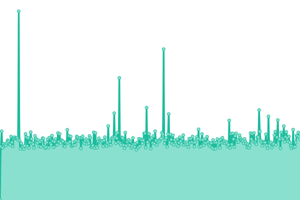 919ms
     
 | 

<a href="https://gelokatil.github.io/upptime-ceu/history/www-ciclosformativosceu-es">100.00%</a>
    

|  [institutofamilia.ceu.es](https://institutofamilia.ceu.es) | 🟩 Up | [institutofamilia-ceu-es.yml](https://github.com/gelokatil/upptime-ceu/commits/HEAD/history/institutofamilia-ceu-es.yml) | 

 2573ms
     
 | 

<a href="https://gelokatil.github.io/upptime-ceu/history/institutofamilia-ceu-es">88.62%</a>
    

|  [www.colegioceuvalencia.es](https://www.colegioceuvalencia.es) | 🟩 Up | [www-colegioceuvalencia-es.yml](https://github.com/gelokatil/upptime-ceu/commits/HEAD/history/www-colegioceuvalencia-es.yml) | 

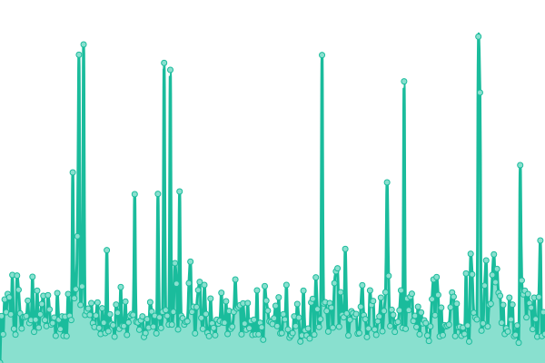 681ms
     
 | 

<a href="https://gelokatil.github.io/upptime-ceu/history/www-colegioceuvalencia-es">100.00%</a>
    

|  [www.colegioceumonteprincipe.es](https://www.colegioceumonteprincipe.es) | 🟩 Up | [www-colegioceumonteprincipe-es.yml](https://github.com/gelokatil/upptime-ceu/commits/HEAD/history/www-colegioceumonteprincipe-es.yml) | 

 686ms
     
 | 

<a href="https://gelokatil.github.io/upptime-ceu/history/www-colegioceumonteprincipe-es">100.00%</a>
    

|  [www.colegioceumurcia.es](https://www.colegioceumurcia.es) | 🟩 Up | [www-colegioceumurcia-es.yml](https://github.com/gelokatil/upptime-ceu/commits/HEAD/history/www-colegioceumurcia-es.yml) | 

 676ms
     
 | 

<a href="https://gelokatil.github.io/upptime-ceu/history/www-colegioceumurcia-es">100.00%</a>
    

|  [www.colegioceualicante.es](https://www.colegioceualicante.es) | 🟩 Up | [www-colegioceualicante-es.yml](https://github.com/gelokatil/upptime-ceu/commits/HEAD/history/www-colegioceualicante-es.yml) | 

 679ms
     
 | 

<a href="https://gelokatil.github.io/upptime-ceu/history/www-colegioceualicante-es">100.00%</a>
    

|  [www.colegioceuvitoria.es](https://www.colegioceuvitoria.es) | 🟩 Up | [www-colegioceuvitoria-es.yml](https://github.com/gelokatil/upptime-ceu/commits/HEAD/history/www-colegioceuvitoria-es.yml) | 

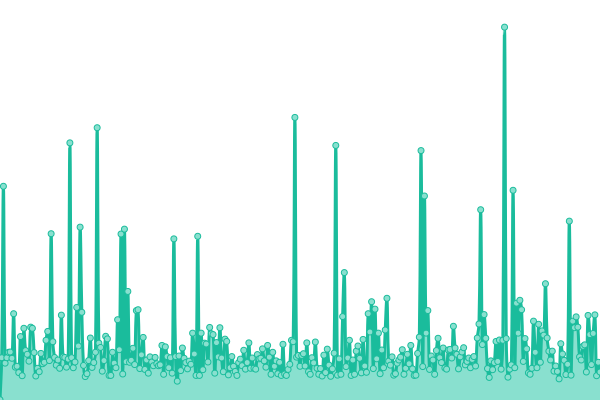 679ms
     
 | 

<a href="https://gelokatil.github.io/upptime-ceu/history/www-colegioceuvitoria-es">100.00%</a>
    

|  [www.colegioceusanchinarro.es](https://www.colegioceusanchinarro.es) | 🟩 Up | [www-colegioceusanchinarro-es.yml](https://github.com/gelokatil/upptime-ceu/commits/HEAD/history/www-colegioceusanchinarro-es.yml) | 

 627ms
     
 | 

<a href="https://gelokatil.github.io/upptime-ceu/history/www-colegioceusanchinarro-es">100.00%</a>
    

|  [www.colegioceuclaudiocoello.es](https://www.colegioceuclaudiocoello.es) | 🟩 Up | [www-colegioceuclaudiocoello-es.yml](https://github.com/gelokatil/upptime-ceu/commits/HEAD/history/www-colegioceuclaudiocoello-es.yml) | 

 624ms
     
 | 

<a href="https://gelokatil.github.io/upptime-ceu/history/www-colegioceuclaudiocoello-es">100.00%</a>
    

|  [admision.uspceu.es](https://admision.uspceu.es) | 🟩 Up | [admision-uspceu-es.yml](https://github.com/gelokatil/upptime-ceu/commits/HEAD/history/admision-uspceu-es.yml) | 

 2310ms
     
 | 

<a href="https://gelokatil.github.io/upptime-ceu/history/admision-uspceu-es">100.00%</a>
    

|  [www.caminoespiritualdelsur.com](https://www.caminoespiritualdelsur.com) | 🟩 Up | [www-caminoespiritualdelsur-com.yml](https://github.com/gelokatil/upptime-ceu/commits/HEAD/history/www-caminoespiritualdelsur-com.yml) | 

 3551ms
     
 | 

<a href="https://gelokatil.github.io/upptime-ceu/history/www-caminoespiritualdelsur-com">100.00%</a>
    

|  [www.clubemprendedoresceu.com](http://www.clubemprendedoresceu.com) | 🟥 Down | [www-clubemprendedoresceu-com.yml](https://github.com/gelokatil/upptime-ceu/commits/HEAD/history/www-clubemprendedoresceu-com.yml) | 

 0ms
     
 | 

<a href="https://gelokatil.github.io/upptime-ceu/history/www-clubemprendedoresceu-com">0.00%</a>
    

|  [www.angelayala.ceu.es](https://www.angelayala.ceu.es) | 🟩 Up | [www-angelayala-ceu-es.yml](https://github.com/gelokatil/upptime-ceu/commits/HEAD/history/www-angelayala-ceu-es.yml) | 

 627ms
     
 | 

<a href="https://gelokatil.github.io/upptime-ceu/history/www-angelayala-ceu-es">99.19%</a>
    

|  [admisionint.uspceu.es](https://admisionint.uspceu.es) | 🟩 Up | [admisionint-uspceu-es.yml](https://github.com/gelokatil/upptime-ceu/commits/HEAD/history/admisionint-uspceu-es.yml) | 

 2672ms
     
 | 

<a href="https://gelokatil.github.io/upptime-ceu/history/admisionint-uspceu-es">100.00%</a>
    

|  [revistas.uspceu.com](https://revistas.uspceu.com) | 🟩 Up | [revistas-uspceu-com.yml](https://github.com/gelokatil/upptime-ceu/commits/HEAD/history/revistas-uspceu-com.yml) | 

 3666ms
     
 | 

<a href="https://gelokatil.github.io/upptime-ceu/history/revistas-uspceu-com">100.00%</a>
    

|  [appsintranet.ceu.es](https://appsintranet.ceu.es) | 🟩 Up | [appsintranet-ceu-es.yml](https://github.com/gelokatil/upptime-ceu/commits/HEAD/history/appsintranet-ceu-es.yml) | 

 654ms
     
 | 

<a href="https://gelokatil.github.io/upptime-ceu/history/appsintranet-ceu-es">100.00%</a>
    

|  [admisionescolegios.ceu.es](https://admisionescolegios.ceu.es) | 🟩 Up | [admisionescolegios-ceu-es.yml](https://github.com/gelokatil/upptime-ceu/commits/HEAD/history/admisionescolegios-ceu-es.yml) | 

 710ms
     
 | 

<a href="https://gelokatil.github.io/upptime-ceu/history/admisionescolegios-ceu-es">100.00%</a>
    

|  [admision.isepceu.es](https://admision.isepceu.es) | 🟩 Up | [admision-isepceu-es.yml](https://github.com/gelokatil/upptime-ceu/commits/HEAD/history/admision-isepceu-es.yml) | 

 687ms
     
 | 

<a href="https://gelokatil.github.io/upptime-ceu/history/admision-isepceu-es">100.00%</a>
    

|  [admision.uaoceu.es](https://admision.uaoceu.es) | 🟩 Up | [admision-uaoceu-es.yml](https://github.com/gelokatil/upptime-ceu/commits/HEAD/history/admision-uaoceu-es.yml) | 

 885ms
     
 | 

<a href="https://gelokatil.github.io/upptime-ceu/history/admision-uaoceu-es">100.00%</a>
    

|  [admisioniam.ceu.es](https://admisioniam.ceu.es) | 🟩 Up | [admisioniam-ceu-es.yml](https://github.com/gelokatil/upptime-ceu/commits/HEAD/history/admisioniam-ceu-es.yml) | 

 2112ms
     
 | 

<a href="https://gelokatil.github.io/upptime-ceu/history/admisioniam-ceu-es">100.00%</a>
    

|  [exploria-erasmus.com](http://exploria-erasmus.com) | 🟩 Up | [exploria-erasmus-com.yml](https://github.com/gelokatil/upptime-ceu/commits/HEAD/history/exploria-erasmus-com.yml) | 

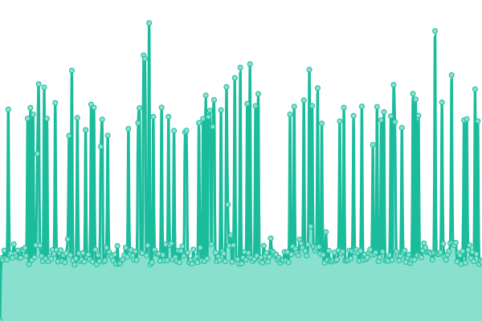 561ms
     
 | 

<a href="https://gelokatil.github.io/upptime-ceu/history/exploria-erasmus-com">100.00%</a>
    

|  [altasolicitudesinfo.ceu.es](https://altasolicitudesinfo.ceu.es) | 🟩 Up | [altasolicitudesinfo-ceu-es.yml](https://github.com/gelokatil/upptime-ceu/commits/HEAD/history/altasolicitudesinfo-ceu-es.yml) | 

 694ms
     
 | 

<a href="https://gelokatil.github.io/upptime-ceu/history/altasolicitudesinfo-ceu-es">100.00%</a>
    

|  [gcet19.uspceu.es](https://gcet19.uspceu.es) | 🟩 Up | [gcet19-uspceu-es.yml](https://github.com/gelokatil/upptime-ceu/commits/HEAD/history/gcet19-uspceu-es.yml) | 

 1919ms
     
 | 

<a href="https://gelokatil.github.io/upptime-ceu/history/gcet19-uspceu-es">100.00%</a>
    

|  [www.jornadas.ceu.es](https://www.jornadas.ceu.es) | 🟩 Up | [www-jornadas-ceu-es.yml](https://github.com/gelokatil/upptime-ceu/commits/HEAD/history/www-jornadas-ceu-es.yml) | 

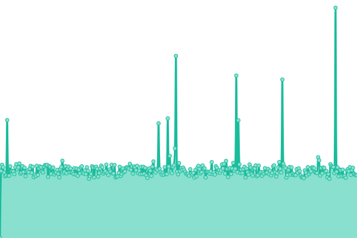 716ms
     
 | 

<a href="https://gelokatil.github.io/upptime-ceu/history/www-jornadas-ceu-es">100.00%</a>
    

|  [www.culturajoven.es](https://www.culturajoven.es) | 🟩 Up | [www-culturajoven-es.yml](https://github.com/gelokatil/upptime-ceu/commits/HEAD/history/www-culturajoven-es.yml) | 

 3536ms
     
 | 

<a href="https://gelokatil.github.io/upptime-ceu/history/www-culturajoven-es">100.00%</a>
    

|  [onceulab.com](http://onceulab.com) | 🟩 Up | [onceulab-com.yml](https://github.com/gelokatil/upptime-ceu/commits/HEAD/history/onceulab-com.yml) | 

 2104ms
     
 | 

<a href="https://gelokatil.github.io/upptime-ceu/history/onceulab-com">100.00%</a>
    

|  [centroaudiovisual.uspceu.com](https://centroaudiovisual.uspceu.com) | 🟩 Up | [centroaudiovisual-uspceu-com.yml](https://github.com/gelokatil/upptime-ceu/commits/HEAD/history/centroaudiovisual-uspceu-com.yml) | 

 859ms
     
 | 

<a href="https://gelokatil.github.io/upptime-ceu/history/centroaudiovisual-uspceu-com">100.00%</a>
    

|  [provuldig.com](http://provuldig.com) | 🟩 Up | [provuldig-com.yml](https://github.com/gelokatil/upptime-ceu/commits/HEAD/history/provuldig-com.yml) | 

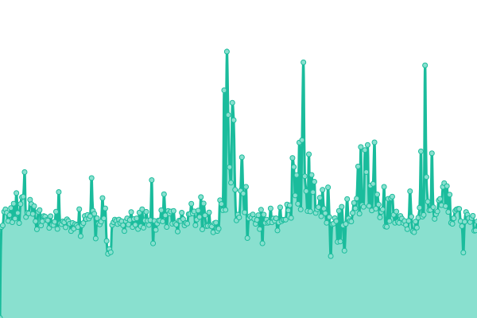 3668ms
     
 | 

<a href="https://gelokatil.github.io/upptime-ceu/history/provuldig-com">100.00%</a>
    

|  [www.idee.ceu.es](https://www.idee.ceu.es) | 🟩 Up | [www-idee-ceu-es.yml](https://github.com/gelokatil/upptime-ceu/commits/HEAD/history/www-idee-ceu-es.yml) | 

 2930ms
     
 | 

<a href="https://gelokatil.github.io/upptime-ceu/history/www-idee-ceu-es">100.00%</a>
    

|  [protocolo.isepceu.es](https://protocolo.isepceu.es) | 🟩 Up | [protocolo-isepceu-es.yml](https://github.com/gelokatil/upptime-ceu/commits/HEAD/history/protocolo-isepceu-es.yml) | 

 818ms
     
 | 

<a href="https://gelokatil.github.io/upptime-ceu/history/protocolo-isepceu-es">100.00%</a>
    

|  [www.educacionporderecho.com](https://www.educacionporderecho.com) | 🟩 Up | [www-educacionporderecho-com.yml](https://github.com/gelokatil/upptime-ceu/commits/HEAD/history/www-educacionporderecho-com.yml) | 

 987ms
     
 | 

<a href="https://gelokatil.github.io/upptime-ceu/history/www-educacionporderecho-com">100.00%</a>
    

|  [100peliculashistoricas.ceu.es](https://100peliculashistoricas.ceu.es) | 🟩 Up | [100peliculashistoricas-ceu-es.yml](https://github.com/gelokatil/upptime-ceu/commits/HEAD/history/100peliculashistoricas-ceu-es.yml) | 

 2125ms
     
 | 

<a href="https://gelokatil.github.io/upptime-ceu/history/100peliculashistoricas-ceu-es">87.49%</a>
    

|  [observatorio-btl.uchceu.es](http://observatorio-btl.uchceu.es) | 🟩 Up | [observatorio-btl-uchceu-es.yml](https://github.com/gelokatil/upptime-ceu/commits/HEAD/history/observatorio-btl-uchceu-es.yml) | 

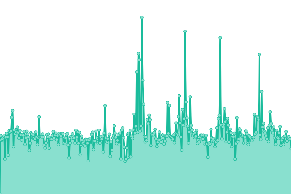 1742ms
     
 | 

<a href="https://gelokatil.github.io/upptime-ceu/history/observatorio-btl-uchceu-es">100.00%</a>
    

|  [www.ceumedia.es](http://www.ceumedia.es) | 🟩 Up | [www-ceumedia-es.yml](https://github.com/gelokatil/upptime-ceu/commits/HEAD/history/www-ceumedia-es.yml) | 

 3329ms
     
 | 

<a href="https://gelokatil.github.io/upptime-ceu/history/www-ceumedia-es">100.00%</a>
    

|  [admisiontech.ceu.es](https://admisiontech.ceu.es) | 🟩 Up | [admisiontech-ceu-es.yml](https://github.com/gelokatil/upptime-ceu/commits/HEAD/history/admisiontech-ceu-es.yml) | 

 2054ms
     
 | 

<a href="https://gelokatil.github.io/upptime-ceu/history/admisiontech-ceu-es">100.00%</a>
    

|  [www.vividores.org](https://www.vividores.org) | 🟩 Up | [www-vividores-org.yml](https://github.com/gelokatil/upptime-ceu/commits/HEAD/history/www-vividores-org.yml) | 

 3575ms
     
 | 

<a href="https://gelokatil.github.io/upptime-ceu/history/www-vividores-org">87.50%</a>
    

|  [www.provuldig2.com](https://www.provuldig2.com) | 🟩 Up | [www-provuldig2-com.yml](https://github.com/gelokatil/upptime-ceu/commits/HEAD/history/www-provuldig2-com.yml) | 

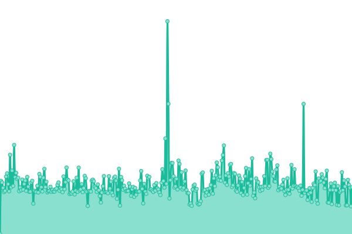 5015ms
     
 | 

<a href="https://gelokatil.github.io/upptime-ceu/history/www-provuldig2-com">100.00%</a>
    

|  [www.acdp.es](https://www.acdp.es) | 🟩 Up | [www-acdp-es.yml](https://github.com/gelokatil/upptime-ceu/commits/HEAD/history/www-acdp-es.yml) | 

 4401ms
     
 | 

<a href="https://gelokatil.github.io/upptime-ceu/history/www-acdp-es">100.00%</a>
    

|  [admisionuchinternacional.ceu.es](https://admisionuchinternacional.ceu.es) | 🟩 Up | [admisionuchinternacional-ceu-es.yml](https://github.com/gelokatil/upptime-ceu/commits/HEAD/history/admisionuchinternacional-ceu-es.yml) | 

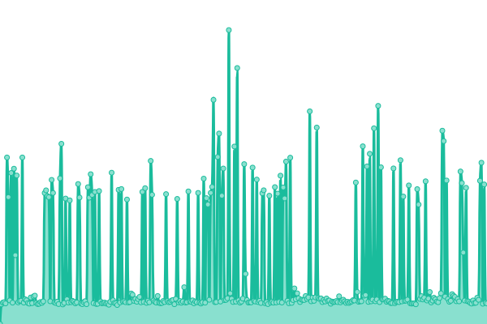 2422ms
     
 | 

<a href="https://gelokatil.github.io/upptime-ceu/history/admisionuchinternacional-ceu-es">100.00%</a>
    

|  [www.ceualumni.com](https://www.ceualumni.com) | 🟩 Up | [www-ceualumni-com.yml](https://github.com/gelokatil/upptime-ceu/commits/HEAD/history/www-ceualumni-com.yml) | 

 8270ms
     
 | 

<a href="https://gelokatil.github.io/upptime-ceu/history/www-ceualumni-com">87.45%</a>
    

|  [www.congreso.ceu.es](https://www.congreso.ceu.es) | 🟩 Up | [www-congreso-ceu-es.yml](https://github.com/gelokatil/upptime-ceu/commits/HEAD/history/www-congreso-ceu-es.yml) | 

 5286ms
     
 | 

<a href="https://gelokatil.github.io/upptime-ceu/history/www-congreso-ceu-es">100.00%</a>
    

|  [yolibre.org](https://yolibre.org) | 🟩 Up | [yolibre-org.yml](https://github.com/gelokatil/upptime-ceu/commits/HEAD/history/yolibre-org.yml) | 

 1027ms
     
 | 

<a href="https://gelokatil.github.io/upptime-ceu/history/yolibre-org">100.00%</a>
    

|  [www.aguadelceu.com](http://www.aguadelceu.com) | 🟩 Up | [www-aguadelceu-com.yml](https://github.com/gelokatil/upptime-ceu/commits/HEAD/history/www-aguadelceu-com.yml) | 

 976ms
     
 | 

<a href="https://gelokatil.github.io/upptime-ceu/history/www-aguadelceu-com">99.19%</a>
    

|  [comoenlos50.com](https://comoenlos50.com) | 🟩 Up | [comoenlos50-com.yml](https://github.com/gelokatil/upptime-ceu/commits/HEAD/history/comoenlos50-com.yml) | 

 849ms
     
 | 

<a href="https://gelokatil.github.io/upptime-ceu/history/comoenlos50-com">100.00%</a>
    

|  [www.lanuevacarteradelaministra.com](https://www.lanuevacarteradelaministra.com) | 🟩 Up | [www-lanuevacarteradelaministra-com.yml](https://github.com/gelokatil/upptime-ceu/commits/HEAD/history/www-lanuevacarteradelaministra-com.yml) | 

 2054ms
     
 | 

<a href="https://gelokatil.github.io/upptime-ceu/history/www-lanuevacarteradelaministra-com">100.00%</a>
    

|  [www.ceuediciones.es](https://www.ceuediciones.es) | 🟩 Up | [www-ceuediciones-es.yml](https://github.com/gelokatil/upptime-ceu/commits/HEAD/history/www-ceuediciones-es.yml) | 

 4617ms
     
 | 

<a href="https://gelokatil.github.io/upptime-ceu/history/www-ceuediciones-es">100.00%</a>
    

|  [www.hubceu.es](https://www.hubceu.es) | 🟩 Up | [www-hubceu-es.yml](https://github.com/gelokatil/upptime-ceu/commits/HEAD/history/www-hubceu-es.yml) | 

 6872ms
     
 | 

<a href="https://gelokatil.github.io/upptime-ceu/history/www-hubceu-es">100.00%</a>
    

|  [www.graciasenunminuto.com](https://www.graciasenunminuto.com) | 🟩 Up | [www-graciasenunminuto-com.yml](https://github.com/gelokatil/upptime-ceu/commits/HEAD/history/www-graciasenunminuto-com.yml) | 

 3265ms
     
 | 

<a href="https://gelokatil.github.io/upptime-ceu/history/www-graciasenunminuto-com">100.00%</a>
    

|  [www.pormuchasrazones.es](https://www.pormuchasrazones.es) | 🟩 Up | [www-pormuchasrazones-es.yml](https://github.com/gelokatil/upptime-ceu/commits/HEAD/history/www-pormuchasrazones-es.yml) | 

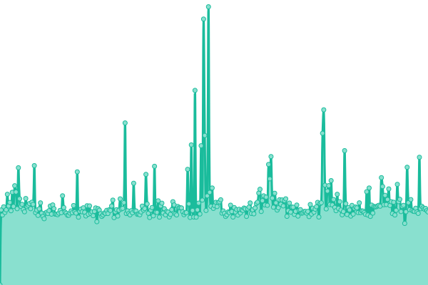 2097ms
     
 | 

<a href="https://gelokatil.github.io/upptime-ceu/history/www-pormuchasrazones-es">100.00%</a>
    

|  [www.noticiario1936.com](http://www.noticiario1936.com) | 🟩 Up | [www-noticiario1936-com.yml](https://github.com/gelokatil/upptime-ceu/commits/HEAD/history/www-noticiario1936-com.yml) | 

 364ms
     
 | 

<a href="https://gelokatil.github.io/upptime-ceu/history/www-noticiario1936-com">100.00%</a>
    

|  [www.bibliotecaceu.es](http://www.bibliotecaceu.es) | 🟩 Up | [www-bibliotecaceu-es.yml](https://github.com/gelokatil/upptime-ceu/commits/HEAD/history/www-bibliotecaceu-es.yml) | 

 581ms
     
 | 

<a href="https://gelokatil.github.io/upptime-ceu/history/www-bibliotecaceu-es">100.00%</a>
    

|  [haleoalicante.ceu.es](https://haleoalicante.ceu.es) | 🟥 Down | [haleoalicante-ceu-es.yml](https://github.com/gelokatil/upptime-ceu/commits/HEAD/history/haleoalicante-ceu-es.yml) | 

 1748ms
     
 | 

<a href="https://gelokatil.github.io/upptime-ceu/history/haleoalicante-ceu-es">0.00%</a>
    

|  [innovationweek.ceu.es](https://innovationweek.ceu.es) | 🟩 Up | [innovationweek-ceu-es.yml](https://github.com/gelokatil/upptime-ceu/commits/HEAD/history/innovationweek-ceu-es.yml) | 

 951ms
     
 | 

<a href="https://gelokatil.github.io/upptime-ceu/history/innovationweek-ceu-es">100.00%</a>
    

|  [www.fundacionaho.es](https://www.fundacionaho.es) | 🟩 Up | [www-fundacionaho-es.yml](https://github.com/gelokatil/upptime-ceu/commits/HEAD/history/www-fundacionaho-es.yml) | 

 882ms
     
 | 

<a href="https://gelokatil.github.io/upptime-ceu/history/www-fundacionaho-es">100.00%</a>
    

|  [francescoeconomy.ceu.es](https://francescoeconomy.ceu.es) | 🟩 Up | [francescoeconomy-ceu-es.yml](https://github.com/gelokatil/upptime-ceu/commits/HEAD/history/francescoeconomy-ceu-es.yml) | 

 850ms
     
 | 

<a href="https://gelokatil.github.io/upptime-ceu/history/francescoeconomy-ceu-es">100.00%</a>
    

|  [moodlecmtp.ceu.es](https://moodlecmtp.ceu.es) | 🟩 Up | [moodlecmtp-ceu-es.yml](https://github.com/gelokatil/upptime-ceu/commits/HEAD/history/moodlecmtp-ceu-es.yml) | 

 1834ms
     
 | 

<a href="https://gelokatil.github.io/upptime-ceu/history/moodlecmtp-ceu-es">100.00%</a>
    

|  [iehistoricos.ceu.es](https://iehistoricos.ceu.es) | 🟩 Up | [iehistoricos-ceu-es.yml](https://github.com/gelokatil/upptime-ceu/commits/HEAD/history/iehistoricos-ceu-es.yml) | 

 6429ms
     
 | 

<a href="https://gelokatil.github.io/upptime-ceu/history/iehistoricos-ceu-es">87.46%</a>
    

|  [institutodemocracia.ceu.es](https://institutodemocracia.ceu.es) | 🟩 Up | [institutodemocracia-ceu-es.yml](https://github.com/gelokatil/upptime-ceu/commits/HEAD/history/institutodemocracia-ceu-es.yml) | 

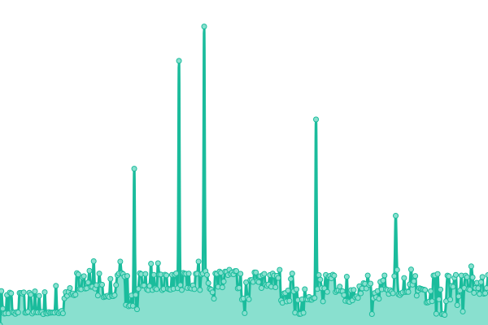 3667ms
     
 | 

<a href="https://gelokatil.github.io/upptime-ceu/history/institutodemocracia-ceu-es">87.47%</a>
    

|  [revistascientificas.uspceu.com](https://revistascientificas.uspceu.com) | 🟩 Up | [revistascientificas-uspceu-com.yml](https://github.com/gelokatil/upptime-ceu/commits/HEAD/history/revistascientificas-uspceu-com.yml) | 

 1072ms
     
 | 

<a href="https://gelokatil.github.io/upptime-ceu/history/revistascientificas-uspceu-com">100.00%</a>
    

|  [cembio.uspceu.es](https://cembio.uspceu.es) | 🟩 Up | [cembio-uspceu-es.yml](https://github.com/gelokatil/upptime-ceu/commits/HEAD/history/cembio-uspceu-es.yml) | 

 4826ms
     
 | 

<a href="https://gelokatil.github.io/upptime-ceu/history/cembio-uspceu-es">87.36%</a>
    

|  [blog.ciclosformativosceu.es](https://blog.ciclosformativosceu.es) | 🟩 Up | [blog-ciclosformativosceu-es.yml](https://github.com/gelokatil/upptime-ceu/commits/HEAD/history/blog-ciclosformativosceu-es.yml) | 

 4619ms
     
 | 

<a href="https://gelokatil.github.io/upptime-ceu/history/blog-ciclosformativosceu-es">87.08%</a>
    

|  [presslext.ceu.es](https://presslext.ceu.es) | 🟩 Up | [presslext-ceu-es.yml](https://github.com/gelokatil/upptime-ceu/commits/HEAD/history/presslext-ceu-es.yml) | 

 669ms
     
 | 

<a href="https://gelokatil.github.io/upptime-ceu/history/presslext-ceu-es">100.00%</a>
    

|  [citeceu.ceu.es](https://citeceu.ceu.es) | 🟩 Up | [citeceu-ceu-es.yml](https://github.com/gelokatil/upptime-ceu/commits/HEAD/history/citeceu-ceu-es.yml) | 

 2309ms
     
 | 

<a href="https://gelokatil.github.io/upptime-ceu/history/citeceu-ceu-es">100.00%</a>
    

|  [congreso.provuldig.com](http://congreso.provuldig.com) | 🟩 Up | [congreso-provuldig-com.yml](https://github.com/gelokatil/upptime-ceu/commits/HEAD/history/congreso-provuldig-com.yml) | 

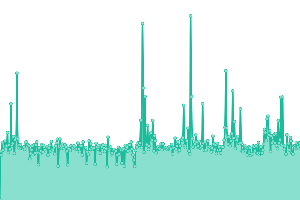 1165ms
     
 | 

<a href="https://gelokatil.github.io/upptime-ceu/history/congreso-provuldig-com">100.00%</a>
    

|  [www.educaceu.es](http://www.educaceu.es) | 🟩 Up | [www-educaceu-es.yml](https://github.com/gelokatil/upptime-ceu/commits/HEAD/history/www-educaceu-es.yml) | 

 1356ms
     
 | 

<a href="https://gelokatil.github.io/upptime-ceu/history/www-educaceu-es">100.00%</a>
    

|  [manage.ceu.es](https://manage.ceu.es) | 🟩 Up | [manage-ceu-es.yml](https://github.com/gelokatil/upptime-ceu/commits/HEAD/history/manage-ceu-es.yml) | 

 603ms
     
 | 

<a href="https://gelokatil.github.io/upptime-ceu/history/manage-ceu-es">100.00%</a>
    

|  [www.encuentrofamiliasceu.com](https://www.encuentrofamiliasceu.com) | 🟥 Down | [www-encuentrofamiliasceu-com.yml](https://github.com/gelokatil/upptime-ceu/commits/HEAD/history/www-encuentrofamiliasceu-com.yml) | 

 0ms
     
 | 

<a href="https://gelokatil.github.io/upptime-ceu/history/www-encuentrofamiliasceu-com">0.00%</a>
    

|  [rss.uchceu.es](https://rss.uchceu.es) | 🟩 Up | [rss-uchceu-es.yml](https://github.com/gelokatil/upptime-ceu/commits/HEAD/history/rss-uchceu-es.yml) | 

 1785ms
     
 | 

<a href="https://gelokatil.github.io/upptime-ceu/history/rss-uchceu-es">100.00%</a>
    

|  [intranet.ceu.es](https://intranet.ceu.es/loginceu/Login.aspx) | 🟩 Up | [intranet-ceu-es.yml](https://github.com/gelokatil/upptime-ceu/commits/HEAD/history/intranet-ceu-es.yml) | 

 545ms
     
 | 

<a href="https://gelokatil.github.io/upptime-ceu/history/intranet-ceu-es">99.19%</a>
    

|  [www.ceucyl.com](https://www.ceucyl.com) | 🟩 Up | [www-ceucyl-com.yml](https://github.com/gelokatil/upptime-ceu/commits/HEAD/history/www-ceucyl-com.yml) | 

 3177ms
     
 | 

<a href="https://gelokatil.github.io/upptime-ceu/history/www-ceucyl-com">100.00%</a>
    

|  [blogs.uao.es](https://blogs.uao.es) | 🟩 Up | [blogs-uao-es.yml](https://github.com/gelokatil/upptime-ceu/commits/HEAD/history/blogs-uao-es.yml) | 

 2346ms
     
 | 

<a href="https://gelokatil.github.io/upptime-ceu/history/blogs-uao-es">87.09%</a>
    

|  [aulanews.uao.es](https://aulanews.uao.es) | 🟩 Up | [aulanews-uao-es.yml](https://github.com/gelokatil/upptime-ceu/commits/HEAD/history/aulanews-uao-es.yml) | 

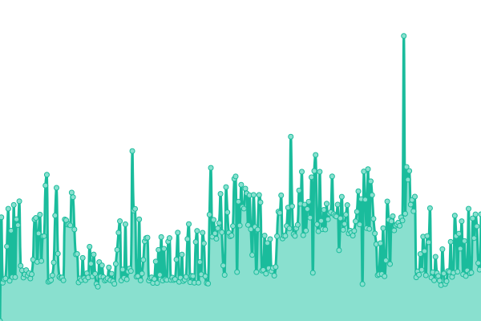 4110ms
     
 | 

<a href="https://gelokatil.github.io/upptime-ceu/history/aulanews-uao-es">87.12%</a>
    

|  [tuestrellapolar.uaoceu.es](https://tuestrellapolar.uaoceu.es) | 🟩 Up | [tuestrellapolar-uaoceu-es.yml](https://github.com/gelokatil/upptime-ceu/commits/HEAD/history/tuestrellapolar-uaoceu-es.yml) | 

 897ms
     
 | 

<a href="https://gelokatil.github.io/upptime-ceu/history/tuestrellapolar-uaoceu-es">87.49%</a>
    

|  [enquestes.uao.es](https://enquestes.uao.es) | 🟥 Down | [enquestes-uao-es.yml](https://github.com/gelokatil/upptime-ceu/commits/HEAD/history/enquestes-uao-es.yml) | 

 0ms
     
 | 

<a href="https://gelokatil.github.io/upptime-ceu/history/enquestes-uao-es">0.00%</a>
    

|  [feriainternacional.ceu.es](https://feriainternacional.ceu.es) | 🟩 Up | [feriainternacional-ceu-es.yml](https://github.com/gelokatil/upptime-ceu/commits/HEAD/history/feriainternacional-ceu-es.yml) | 

 966ms
     
 | 

<a href="https://gelokatil.github.io/upptime-ceu/history/feriainternacional-ceu-es">100.00%</a>
    

|  [500pacifico.uaoceu.es](https://500pacifico.uaoceu.es) | 🟩 Up | [500pacifico-uaoceu-es.yml](https://github.com/gelokatil/upptime-ceu/commits/HEAD/history/500pacifico-uaoceu-es.yml) | 

 2671ms
     
 | 

<a href="https://gelokatil.github.io/upptime-ceu/history/500pacifico-uaoceu-es">87.13%</a>
    

|  [www.ceudigital.com](https://www.ceudigital.com) | 🟩 Up | [www-ceudigital-com.yml](https://github.com/gelokatil/upptime-ceu/commits/HEAD/history/www-ceudigital-com.yml) | 

 2244ms
     
 | 

<a href="https://gelokatil.github.io/upptime-ceu/history/www-ceudigital-com">100.00%</a>
    

|  [admisionuch.ceu.es](https://admisionuch.ceu.es) | 🟩 Up | [admisionuch-ceu-es.yml](https://github.com/gelokatil/upptime-ceu/commits/HEAD/history/admisionuch-ceu-es.yml) | 

 928ms
     
 | 

<a href="https://gelokatil.github.io/upptime-ceu/history/admisionuch-ceu-es">100.00%</a>
    

|  [blog.uchceu.es](https://blog.uchceu.es) | 🟩 Up | [blog-uchceu-es.yml](https://github.com/gelokatil/upptime-ceu/commits/HEAD/history/blog-uchceu-es.yml) | 

 1294ms
     
 | 

<a href="https://gelokatil.github.io/upptime-ceu/history/blog-uchceu-es">100.00%</a>
    

|  [medios.uchceu.es](https://medios.uchceu.es) | 🟩 Up | [medios-uchceu-es.yml](https://github.com/gelokatil/upptime-ceu/commits/HEAD/history/medios-uchceu-es.yml) | 

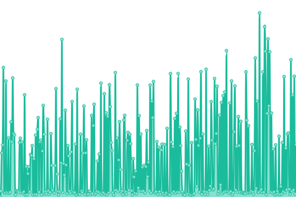 4564ms
     
 | 

<a href="https://gelokatil.github.io/upptime-ceu/history/medios-uchceu-es">100.00%</a>
    

|  [3d.ceu.es](https://3d.ceu.es) | 🟩 Up | [3d-ceu-es.yml](https://github.com/gelokatil/upptime-ceu/commits/HEAD/history/3d-ceu-es.yml) | 

 1751ms
     
 | 

<a href="https://gelokatil.github.io/upptime-ceu/history/3d-ceu-es">100.00%</a>
    

|  [www.goliads.com](https://www.goliads.com) | 🟩 Up | [www-goliads-com.yml](https://github.com/gelokatil/upptime-ceu/commits/HEAD/history/www-goliads-com.yml) | 

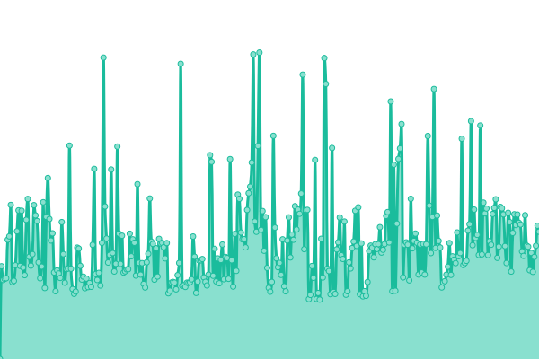 8598ms
     
 | 

<a href="https://gelokatil.github.io/upptime-ceu/history/www-goliads-com">98.64%</a>
    

|  [educationtalks.es](https://educationtalks.es) | 🟩 Up | [educationtalks-es.yml](https://github.com/gelokatil/upptime-ceu/commits/HEAD/history/educationtalks-es.yml) | 

 2720ms
     
 | 

<a href="https://gelokatil.github.io/upptime-ceu/history/educationtalks-es">87.18%</a>
    

|  [www.ceule.es](https://www.ceule.es) | 🟩 Up | [www-ceule-es.yml](https://github.com/gelokatil/upptime-ceu/commits/HEAD/history/www-ceule-es.yml) | 

 3078ms
     
 | 

<a href="https://gelokatil.github.io/upptime-ceu/history/www-ceule-es">100.00%</a>
    

|  [emplea.ceu.es](https://emplea.ceu.es) | 🟩 Up | [emplea-ceu-es.yml](https://github.com/gelokatil/upptime-ceu/commits/HEAD/history/emplea-ceu-es.yml) | 

 677ms
     
 | 

<a href="https://gelokatil.github.io/upptime-ceu/history/emplea-ceu-es">30.58%</a>
    

|  [neurofan.ceu.es](https://neurofan.ceu.es) | 🟩 Up | [neurofan-ceu-es.yml](https://github.com/gelokatil/upptime-ceu/commits/HEAD/history/neurofan-ceu-es.yml) | 

 681ms
     
 | 

<a href="https://gelokatil.github.io/upptime-ceu/history/neurofan-ceu-es">30.55%</a>
    

|  [Chico RedIRIS](130.206.1.3) | 🟩 Up | [chico-red-iris.yml](https://github.com/gelokatil/upptime-ceu/commits/HEAD/history/chico-red-iris.yml) | 

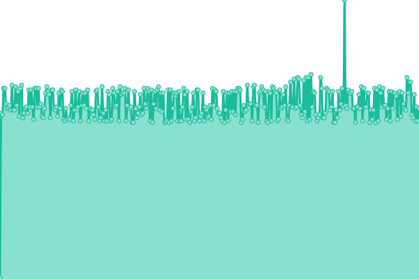 112ms
     
 | 

<a href="https://gelokatil.github.io/upptime-ceu/history/chico-red-iris">100.00%</a>
    

|  [Sun RedIRIS](130.206.1.2) | 🟩 Up | [sun-red-iris.yml](https://github.com/gelokatil/upptime-ceu/commits/HEAD/history/sun-red-iris.yml) | 

 121ms
     
 | 

<a href="https://gelokatil.github.io/upptime-ceu/history/sun-red-iris">100.00%</a>
    

|  [NS CEU](193.146.228.3) | 🟩 Up | [ns-ceu.yml](https://github.com/gelokatil/upptime-ceu/commits/HEAD/history/ns-ceu.yml) | 

 113ms
     
 | 

<a href="https://gelokatil.github.io/upptime-ceu/history/ns-ceu">100.00%</a>
    

|  [VPN CEU](vpn.ceu.es) | 🟩 Up | [vpn-ceu.yml](https://github.com/gelokatil/upptime-ceu/commits/HEAD/history/vpn-ceu.yml) | 

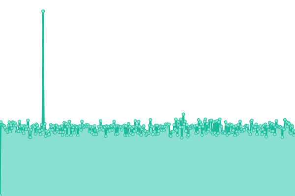 120ms
     
 | 

<a href="https://gelokatil.github.io/upptime-ceu/history/vpn-ceu">100.00%</a>
    

<!--end: status pages-->

[**Visit our status website →**](https://gelokatil.github.io/upptime-ceu)

## 📄 License

- Powered by: [Upptime](https://github.com/upptime/upptime)
- Code: [MIT](./LICENSE) © [Gelo](https://gelokatil.github.io/upptime-ceu)
- Data in the `./history` directory: [Open Database License](https://opendatacommons.org/licenses/odbl/1-0/)
