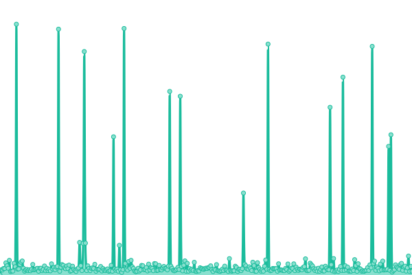

# [📈 Live Status](https://gelokatil.github.io/upptime-ceu): <!--live status--> **🟧 Partial outage**

This repository contains the open-source uptime monitor and status page for [Gelo](https://gelokatil.github.io/upptime-ceu), powered by [Upptime](https://github.com/upptime/upptime).

With [Upptime](https://upptime.js.org), you can get your own unlimited and free uptime monitor and status page, powered entirely by a GitHub repository. We use [Issues](https://github.com/gelokatil/upptime-ceu/issues) as incident reports, [Actions](https://github.com/gelokatil/upptime-ceu/actions) as uptime monitors, and [Pages](https://gelokatil.github.io/upptime-ceu) for the status page.

<!--start: status pages-->
<!-- This summary is generated by Upptime (https://github.com/upptime/upptime) -->
<!-- Do not edit this manually, your changes will be overwritten -->
<!-- prettier-ignore -->
| URL | Status | History | Response Time | Uptime |
| --- | ------ | ------- | ------------- | ------ |
|  [www.ceu.es](https://www.ceu.es) | 🟩 Up | [www-ceu-es.yml](https://github.com/gelokatil/upptime-ceu/commits/HEAD/history/www-ceu-es.yml) | 

 2718ms
     
 | 

<a href="https://gelokatil.github.io/upptime-ceu/history/www-ceu-es">100.00%</a>
    

|  [www.uspceu.com](http://www.uspceu.com) | 🟥 Down | [www-uspceu-com.yml](https://github.com/gelokatil/upptime-ceu/commits/HEAD/history/www-uspceu-com.yml) | 

 0ms
     
 | 

<a href="https://gelokatil.github.io/upptime-ceu/history/www-uspceu-com">0.06%</a>
    

|  [www.uchceu.es](https://www.uchceu.es) | 🟩 Up | [www-uchceu-es.yml](https://github.com/gelokatil/upptime-ceu/commits/HEAD/history/www-uchceu-es.yml) | 

 1284ms
     
 | 

<a href="https://gelokatil.github.io/upptime-ceu/history/www-uchceu-es">63.81%</a>
    

|  [www.uaoceu.es](www.uaoceu.es) | 🟩 Up | [www-uaoceu-es.yml](https://github.com/gelokatil/upptime-ceu/commits/HEAD/history/www-uaoceu-es.yml) | 

 1276ms
     
 | 

<a href="https://gelokatil.github.io/upptime-ceu/history/www-uaoceu-es">100.00%</a>
    

|  [eduroam.ceu.es](https://eduroam.ceu.es) | 🟩 Up | [eduroam-ceu-es.yml](https://github.com/gelokatil/upptime-ceu/commits/HEAD/history/eduroam-ceu-es.yml) | 

 996ms
     
 | 

<a href="https://gelokatil.github.io/upptime-ceu/history/eduroam-ceu-es">100.00%</a>
    

|  [www.ceuuniversities.com](https://www.ceuuniversities.com) | 🟩 Up | [www-ceuuniversities-com.yml](https://github.com/gelokatil/upptime-ceu/commits/HEAD/history/www-ceuuniversities-com.yml) | 

 15422ms
     
 | 

<a href="https://gelokatil.github.io/upptime-ceu/history/www-ceuuniversities-com">100.00%</a>
    

|  [www.isepceu.es](https://www.isepceu.es) | 🟩 Up | [www-isepceu-es.yml](https://github.com/gelokatil/upptime-ceu/commits/HEAD/history/www-isepceu-es.yml) | 

 757ms
     
 | 

<a href="https://gelokatil.github.io/upptime-ceu/history/www-isepceu-es">100.00%</a>
    

|  [www.escueladoctorado.ceu.es](https://www.escueladoctorado.ceu.es) | 🟩 Up | [www-escueladoctorado-ceu-es.yml](https://github.com/gelokatil/upptime-ceu/commits/HEAD/history/www-escueladoctorado-ceu-es.yml) | 

 6995ms
     
 | 

<a href="https://gelokatil.github.io/upptime-ceu/history/www-escueladoctorado-ceu-es">100.00%</a>
    

|  [www.universidadmayoresceu.es](https://www.universidadmayoresceu.es) | 🟩 Up | [www-universidadmayoresceu-es.yml](https://github.com/gelokatil/upptime-ceu/commits/HEAD/history/www-universidadmayoresceu-es.yml) | 

 4803ms
     
 | 

<a href="https://gelokatil.github.io/upptime-ceu/history/www-universidadmayoresceu-es">100.00%</a>
    

|  [www.escuelamagisterioceuvigo.es](https://www.escuelamagisterioceuvigo.es) | 🟩 Up | [www-escuelamagisterioceuvigo-es.yml](https://github.com/gelokatil/upptime-ceu/commits/HEAD/history/www-escuelamagisterioceuvigo-es.yml) | 

 1591ms
     
 | 

<a href="https://gelokatil.github.io/upptime-ceu/history/www-escuelamagisterioceuvigo-es">100.00%</a>
    

|  [www.ciclosformativosceu.es](https://www.ciclosformativosceu.es) | 🟩 Up | [www-ciclosformativosceu-es.yml](https://github.com/gelokatil/upptime-ceu/commits/HEAD/history/www-ciclosformativosceu-es.yml) | 

 909ms
     
 | 

<a href="https://gelokatil.github.io/upptime-ceu/history/www-ciclosformativosceu-es">100.00%</a>
    

|  [institutofamilia.ceu.es](https://institutofamilia.ceu.es) | 🟩 Up | [institutofamilia-ceu-es.yml](https://github.com/gelokatil/upptime-ceu/commits/HEAD/history/institutofamilia-ceu-es.yml) | 

 1889ms
     
 | 

<a href="https://gelokatil.github.io/upptime-ceu/history/institutofamilia-ceu-es">100.00%</a>
    

|  [www.colegioceuvalencia.es](https://www.colegioceuvalencia.es) | 🟩 Up | [www-colegioceuvalencia-es.yml](https://github.com/gelokatil/upptime-ceu/commits/HEAD/history/www-colegioceuvalencia-es.yml) | 

 731ms
     
 | 

<a href="https://gelokatil.github.io/upptime-ceu/history/www-colegioceuvalencia-es">100.00%</a>
    

|  [www.colegioceumonteprincipe.es](https://www.colegioceumonteprincipe.es) | 🟩 Up | [www-colegioceumonteprincipe-es.yml](https://github.com/gelokatil/upptime-ceu/commits/HEAD/history/www-colegioceumonteprincipe-es.yml) | 

 727ms
     
 | 

<a href="https://gelokatil.github.io/upptime-ceu/history/www-colegioceumonteprincipe-es">100.00%</a>
    

|  [www.colegioceumurcia.es](https://www.colegioceumurcia.es) | 🟩 Up | [www-colegioceumurcia-es.yml](https://github.com/gelokatil/upptime-ceu/commits/HEAD/history/www-colegioceumurcia-es.yml) | 

 719ms
     
 | 

<a href="https://gelokatil.github.io/upptime-ceu/history/www-colegioceumurcia-es">100.00%</a>
    

|  [www.colegioceualicante.es](https://www.colegioceualicante.es) | 🟩 Up | [www-colegioceualicante-es.yml](https://github.com/gelokatil/upptime-ceu/commits/HEAD/history/www-colegioceualicante-es.yml) | 

 726ms
     
 | 

<a href="https://gelokatil.github.io/upptime-ceu/history/www-colegioceualicante-es">100.00%</a>
    

|  [www.colegioceuvitoria.es](https://www.colegioceuvitoria.es) | 🟩 Up | [www-colegioceuvitoria-es.yml](https://github.com/gelokatil/upptime-ceu/commits/HEAD/history/www-colegioceuvitoria-es.yml) | 

 736ms
     
 | 

<a href="https://gelokatil.github.io/upptime-ceu/history/www-colegioceuvitoria-es">100.00%</a>
    

|  [www.colegioceusanchinarro.es](https://www.colegioceusanchinarro.es) | 🟩 Up | [www-colegioceusanchinarro-es.yml](https://github.com/gelokatil/upptime-ceu/commits/HEAD/history/www-colegioceusanchinarro-es.yml) | 

 658ms
     
 | 

<a href="https://gelokatil.github.io/upptime-ceu/history/www-colegioceusanchinarro-es">100.00%</a>
    

|  [www.colegioceuclaudiocoello.es](https://www.colegioceuclaudiocoello.es) | 🟩 Up | [www-colegioceuclaudiocoello-es.yml](https://github.com/gelokatil/upptime-ceu/commits/HEAD/history/www-colegioceuclaudiocoello-es.yml) | 

 666ms
     
 | 

<a href="https://gelokatil.github.io/upptime-ceu/history/www-colegioceuclaudiocoello-es">100.00%</a>
    

|  [Chico RedIRIS](130.206.1.3) | 🟩 Up | [chico-red-iris.yml](https://github.com/gelokatil/upptime-ceu/commits/HEAD/history/chico-red-iris.yml) | 

 119ms
     
 | 

<a href="https://gelokatil.github.io/upptime-ceu/history/chico-red-iris">100.00%</a>
    

|  [Sun RedIRIS](130.206.1.2) | 🟩 Up | [sun-red-iris.yml](https://github.com/gelokatil/upptime-ceu/commits/HEAD/history/sun-red-iris.yml) | 

 128ms
     
 | 

<a href="https://gelokatil.github.io/upptime-ceu/history/sun-red-iris">100.00%</a>
    

|  [NS CEU](193.146.228.3) | 🟩 Up | [ns-ceu.yml](https://github.com/gelokatil/upptime-ceu/commits/HEAD/history/ns-ceu.yml) | 

 125ms
     
 | 

<a href="https://gelokatil.github.io/upptime-ceu/history/ns-ceu">100.00%</a>
    

|  [VPN CEU](vpn.ceu.es) | 🟩 Up | [vpn-ceu.yml](https://github.com/gelokatil/upptime-ceu/commits/HEAD/history/vpn-ceu.yml) | 

 142ms
     
 | 

<a href="https://gelokatil.github.io/upptime-ceu/history/vpn-ceu">100.00%</a>
    

<!--end: status pages-->

[**Visit our status website →**](https://gelokatil.github.io/upptime-ceu)

## 📄 License

- Powered by: [Upptime](https://github.com/upptime/upptime)
- Code: [MIT](./LICENSE) © [Gelo](https://gelokatil.github.io/upptime-ceu)
- Data in the `./history` directory: [Open Database License](https://opendatacommons.org/licenses/odbl/1-0/)
