# [📈 Live Status](https://gelokatil.github.io/upptime-ceu): <!--live status--> **🟧 Partial outage**

This repository contains the open-source uptime monitor and status page for [Gelo](https://gelokatil.github.io/upptime-ceu), powered by [Upptime](https://github.com/upptime/upptime).

With [Upptime](https://upptime.js.org), you can get your own unlimited and free uptime monitor and status page, powered entirely by a GitHub repository. We use [Issues](https://github.com/gelokatil/upptime-ceu/issues) as incident reports, [Actions](https://github.com/gelokatil/upptime-ceu/actions) as uptime monitors, and [Pages](https://gelokatil.github.io/upptime-ceu) for the status page.

<!--start: status pages-->
<!-- This summary is generated by Upptime (https://github.com/upptime/upptime) -->
<!-- Do not edit this manually, your changes will be overwritten -->
<!-- prettier-ignore -->
| URL | Status | History | Response Time | Uptime |
| --- | ------ | ------- | ------------- | ------ |
|  [www.ceu.es](https://www.ceu.es) | 🟩 Up | [www-ceu-es.yml](https://github.com/gelokatil/upptime-ceu/commits/HEAD/history/www-ceu-es.yml) | 

 2248ms
     
 | 

<a href="https://gelokatil.github.io/upptime-ceu/history/www-ceu-es">74.88%</a>
    

|  [www.uchceu.es](https://www.uchceu.es) | 🟩 Up | [www-uchceu-es.yml](https://github.com/gelokatil/upptime-ceu/commits/HEAD/history/www-uchceu-es.yml) | 

 1117ms
     
 | 

<a href="https://gelokatil.github.io/upptime-ceu/history/www-uchceu-es">99.83%</a>
    

|  [www.uaoceu.es](www.uaoceu.es) | 🟩 Up | [www-uaoceu-es.yml](https://github.com/gelokatil/upptime-ceu/commits/HEAD/history/www-uaoceu-es.yml) | 

 1370ms
     
 | 

<a href="https://gelokatil.github.io/upptime-ceu/history/www-uaoceu-es">74.89%</a>
    

|  [eduroam.ceu.es](https://eduroam.ceu.es) | 🟩 Up | [eduroam-ceu-es.yml](https://github.com/gelokatil/upptime-ceu/commits/HEAD/history/eduroam-ceu-es.yml) | 

 1424ms
     
 | 

<a href="https://gelokatil.github.io/upptime-ceu/history/eduroam-ceu-es">74.89%</a>
    

|  [www.ceuuniversities.com](https://www.ceuuniversities.com) | 🟩 Up | [www-ceuuniversities-com.yml](https://github.com/gelokatil/upptime-ceu/commits/HEAD/history/www-ceuuniversities-com.yml) | 

 4367ms
     
 | 

<a href="https://gelokatil.github.io/upptime-ceu/history/www-ceuuniversities-com">100.00%</a>
    

|  [www.isepceu.es](https://www.isepceu.es) | 🟩 Up | [www-isepceu-es.yml](https://github.com/gelokatil/upptime-ceu/commits/HEAD/history/www-isepceu-es.yml) | 

 1933ms
     
 | 

<a href="https://gelokatil.github.io/upptime-ceu/history/www-isepceu-es">100.00%</a>
    

|  [www.escueladoctorado.ceu.es](https://www.escueladoctorado.ceu.es) | 🟩 Up | [www-escueladoctorado-ceu-es.yml](https://github.com/gelokatil/upptime-ceu/commits/HEAD/history/www-escueladoctorado-ceu-es.yml) | 

 6071ms
     
 | 

<a href="https://gelokatil.github.io/upptime-ceu/history/www-escueladoctorado-ceu-es">74.90%</a>
    

|  [www.universidadmayoresceu.es](https://www.universidadmayoresceu.es) | 🟩 Up | [www-universidadmayoresceu-es.yml](https://github.com/gelokatil/upptime-ceu/commits/HEAD/history/www-universidadmayoresceu-es.yml) | 

 417ms
     
 | 

<a href="https://gelokatil.github.io/upptime-ceu/history/www-universidadmayoresceu-es">74.90%</a>
    

|  [www.escuelamagisterioceuvigo.es](https://www.escuelamagisterioceuvigo.es) | 🟩 Up | [www-escuelamagisterioceuvigo-es.yml](https://github.com/gelokatil/upptime-ceu/commits/HEAD/history/www-escuelamagisterioceuvigo-es.yml) | 

 2441ms
     
 | 

<a href="https://gelokatil.github.io/upptime-ceu/history/www-escuelamagisterioceuvigo-es">74.90%</a>
    

|  [www.ciclosformativosceu.es](https://www.ciclosformativosceu.es) | 🟩 Up | [www-ciclosformativosceu-es.yml](https://github.com/gelokatil/upptime-ceu/commits/HEAD/history/www-ciclosformativosceu-es.yml) | 

 921ms
     
 | 

<a href="https://gelokatil.github.io/upptime-ceu/history/www-ciclosformativosceu-es">77.76%</a>
    

|  [institutofamilia.ceu.es](https://institutofamilia.ceu.es) | 🟩 Up | [institutofamilia-ceu-es.yml](https://github.com/gelokatil/upptime-ceu/commits/HEAD/history/institutofamilia-ceu-es.yml) | 

 3177ms
     
 | 

<a href="https://gelokatil.github.io/upptime-ceu/history/institutofamilia-ceu-es">74.90%</a>
    

|  [www.colegioceuvalencia.es](https://www.colegioceuvalencia.es) | 🟩 Up | [www-colegioceuvalencia-es.yml](https://github.com/gelokatil/upptime-ceu/commits/HEAD/history/www-colegioceuvalencia-es.yml) | 

 635ms
     
 | 

<a href="https://gelokatil.github.io/upptime-ceu/history/www-colegioceuvalencia-es">74.91%</a>
    

|  [www.colegioceumonteprincipe.es](https://www.colegioceumonteprincipe.es) | 🟩 Up | [www-colegioceumonteprincipe-es.yml](https://github.com/gelokatil/upptime-ceu/commits/HEAD/history/www-colegioceumonteprincipe-es.yml) | 

 686ms
     
 | 

<a href="https://gelokatil.github.io/upptime-ceu/history/www-colegioceumonteprincipe-es">74.91%</a>
    

|  [www.colegioceumurcia.es](https://www.colegioceumurcia.es) | 🟩 Up | [www-colegioceumurcia-es.yml](https://github.com/gelokatil/upptime-ceu/commits/HEAD/history/www-colegioceumurcia-es.yml) | 

 682ms
     
 | 

<a href="https://gelokatil.github.io/upptime-ceu/history/www-colegioceumurcia-es">74.91%</a>
    

|  [www.colegioceualicante.es](https://www.colegioceualicante.es) | 🟩 Up | [www-colegioceualicante-es.yml](https://github.com/gelokatil/upptime-ceu/commits/HEAD/history/www-colegioceualicante-es.yml) | 

 679ms
     
 | 

<a href="https://gelokatil.github.io/upptime-ceu/history/www-colegioceualicante-es">74.91%</a>
    

|  [www.colegioceuvitoria.es](https://www.colegioceuvitoria.es) | 🟩 Up | [www-colegioceuvitoria-es.yml](https://github.com/gelokatil/upptime-ceu/commits/HEAD/history/www-colegioceuvitoria-es.yml) | 

 317ms
     
 | 

<a href="https://gelokatil.github.io/upptime-ceu/history/www-colegioceuvitoria-es">74.92%</a>
    

|  [www.colegioceusanchinarro.es](https://www.colegioceusanchinarro.es) | 🟩 Up | [www-colegioceusanchinarro-es.yml](https://github.com/gelokatil/upptime-ceu/commits/HEAD/history/www-colegioceusanchinarro-es.yml) | 

 614ms
     
 | 

<a href="https://gelokatil.github.io/upptime-ceu/history/www-colegioceusanchinarro-es">74.92%</a>
    

|  [www.colegioceuclaudiocoello.es](https://www.colegioceuclaudiocoello.es) | 🟩 Up | [www-colegioceuclaudiocoello-es.yml](https://github.com/gelokatil/upptime-ceu/commits/HEAD/history/www-colegioceuclaudiocoello-es.yml) | 

 615ms
     
 | 

<a href="https://gelokatil.github.io/upptime-ceu/history/www-colegioceuclaudiocoello-es">74.92%</a>
    

|  [admision.uspceu.es](https://admision.uspceu.es) | 🟩 Up | [admision-uspceu-es.yml](https://github.com/gelokatil/upptime-ceu/commits/HEAD/history/admision-uspceu-es.yml) | 

 2336ms
     
 | 

<a href="https://gelokatil.github.io/upptime-ceu/history/admision-uspceu-es">74.92%</a>
    

|  [www.caminoespiritualdelsur.com](https://www.caminoespiritualdelsur.com) | 🟩 Up | [www-caminoespiritualdelsur-com.yml](https://github.com/gelokatil/upptime-ceu/commits/HEAD/history/www-caminoespiritualdelsur-com.yml) | 

 3741ms
     
 | 

<a href="https://gelokatil.github.io/upptime-ceu/history/www-caminoespiritualdelsur-com">74.93%</a>
    

|  [www.clubemprendedoresceu.com](http://www.clubemprendedoresceu.com) | 🟥 Down | [www-clubemprendedoresceu-com.yml](https://github.com/gelokatil/upptime-ceu/commits/HEAD/history/www-clubemprendedoresceu-com.yml) | 

 0ms
     
 | 

<a href="https://gelokatil.github.io/upptime-ceu/history/www-clubemprendedoresceu-com">74.92%</a>
    

|  [www.angelayala.ceu.es](https://www.angelayala.ceu.es) | 🟩 Up | [www-angelayala-ceu-es.yml](https://github.com/gelokatil/upptime-ceu/commits/HEAD/history/www-angelayala-ceu-es.yml) | 

 616ms
     
 | 

<a href="https://gelokatil.github.io/upptime-ceu/history/www-angelayala-ceu-es">74.93%</a>
    

|  [admisionint.uspceu.es](https://admisionint.uspceu.es) | 🟩 Up | [admisionint-uspceu-es.yml](https://github.com/gelokatil/upptime-ceu/commits/HEAD/history/admisionint-uspceu-es.yml) | 

 2537ms
     
 | 

<a href="https://gelokatil.github.io/upptime-ceu/history/admisionint-uspceu-es">74.93%</a>
    

|  [revistas.uspceu.com](https://revistas.uspceu.com) | 🟩 Up | [revistas-uspceu-com.yml](https://github.com/gelokatil/upptime-ceu/commits/HEAD/history/revistas-uspceu-com.yml) | 

 3894ms
     
 | 

<a href="https://gelokatil.github.io/upptime-ceu/history/revistas-uspceu-com">74.93%</a>
    

|  [appsintranet.ceu.es](https://appsintranet.ceu.es) | 🟩 Up | [appsintranet-ceu-es.yml](https://github.com/gelokatil/upptime-ceu/commits/HEAD/history/appsintranet-ceu-es.yml) | 

 651ms
     
 | 

<a href="https://gelokatil.github.io/upptime-ceu/history/appsintranet-ceu-es">74.94%</a>
    

|  [admisionescolegios.ceu.es](https://admisionescolegios.ceu.es) | 🟩 Up | [admisionescolegios-ceu-es.yml](https://github.com/gelokatil/upptime-ceu/commits/HEAD/history/admisionescolegios-ceu-es.yml) | 

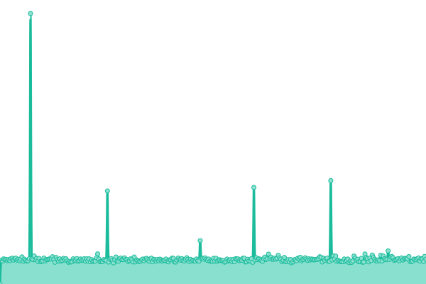 682ms
     
 | 

<a href="https://gelokatil.github.io/upptime-ceu/history/admisionescolegios-ceu-es">74.94%</a>
    

|  [admision.isepceu.es](https://admision.isepceu.es) | 🟩 Up | [admision-isepceu-es.yml](https://github.com/gelokatil/upptime-ceu/commits/HEAD/history/admision-isepceu-es.yml) | 

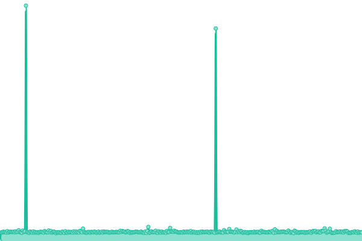 683ms
     
 | 

<a href="https://gelokatil.github.io/upptime-ceu/history/admision-isepceu-es">74.94%</a>
    

|  [admision.uaoceu.es](https://admision.uaoceu.es) | 🟩 Up | [admision-uaoceu-es.yml](https://github.com/gelokatil/upptime-ceu/commits/HEAD/history/admision-uaoceu-es.yml) | 

 931ms
     
 | 

<a href="https://gelokatil.github.io/upptime-ceu/history/admision-uaoceu-es">74.94%</a>
    

|  [admisioniam.ceu.es](https://admisioniam.ceu.es) | 🟩 Up | [admisioniam-ceu-es.yml](https://github.com/gelokatil/upptime-ceu/commits/HEAD/history/admisioniam-ceu-es.yml) | 

 3938ms
     
 | 

<a href="https://gelokatil.github.io/upptime-ceu/history/admisioniam-ceu-es">74.94%</a>
    

|  [exploria-erasmus.com](http://exploria-erasmus.com) | 🟩 Up | [exploria-erasmus-com.yml](https://github.com/gelokatil/upptime-ceu/commits/HEAD/history/exploria-erasmus-com.yml) | 

 779ms
     
 | 

<a href="https://gelokatil.github.io/upptime-ceu/history/exploria-erasmus-com">74.94%</a>
    

|  [altasolicitudesinfo.ceu.es](https://altasolicitudesinfo.ceu.es) | 🟩 Up | [altasolicitudesinfo-ceu-es.yml](https://github.com/gelokatil/upptime-ceu/commits/HEAD/history/altasolicitudesinfo-ceu-es.yml) | 

 749ms
     
 | 

<a href="https://gelokatil.github.io/upptime-ceu/history/altasolicitudesinfo-ceu-es">74.94%</a>
    

|  [gcet19.uspceu.es](https://gcet19.uspceu.es) | 🟩 Up | [gcet19-uspceu-es.yml](https://github.com/gelokatil/upptime-ceu/commits/HEAD/history/gcet19-uspceu-es.yml) | 

 1992ms
     
 | 

<a href="https://gelokatil.github.io/upptime-ceu/history/gcet19-uspceu-es">74.95%</a>
    

|  [www.jornadas.ceu.es](https://www.jornadas.ceu.es) | 🟩 Up | [www-jornadas-ceu-es.yml](https://github.com/gelokatil/upptime-ceu/commits/HEAD/history/www-jornadas-ceu-es.yml) | 

 720ms
     
 | 

<a href="https://gelokatil.github.io/upptime-ceu/history/www-jornadas-ceu-es">74.95%</a>
    

|  [www.culturajoven.es](https://www.culturajoven.es) | 🟩 Up | [www-culturajoven-es.yml](https://github.com/gelokatil/upptime-ceu/commits/HEAD/history/www-culturajoven-es.yml) | 

 3720ms
     
 | 

<a href="https://gelokatil.github.io/upptime-ceu/history/www-culturajoven-es">74.95%</a>
    

|  [onceulab.com](http://onceulab.com) | 🟩 Up | [onceulab-com.yml](https://github.com/gelokatil/upptime-ceu/commits/HEAD/history/onceulab-com.yml) | 

 2314ms
     
 | 

<a href="https://gelokatil.github.io/upptime-ceu/history/onceulab-com">74.95%</a>
    

|  [centroaudiovisual.uspceu.com](https://centroaudiovisual.uspceu.com) | 🟩 Up | [centroaudiovisual-uspceu-com.yml](https://github.com/gelokatil/upptime-ceu/commits/HEAD/history/centroaudiovisual-uspceu-com.yml) | 

 844ms
     
 | 

<a href="https://gelokatil.github.io/upptime-ceu/history/centroaudiovisual-uspceu-com">74.96%</a>
    

|  [provuldig.com](http://provuldig.com) | 🟩 Up | [provuldig-com.yml](https://github.com/gelokatil/upptime-ceu/commits/HEAD/history/provuldig-com.yml) | 

 3972ms
     
 | 

<a href="https://gelokatil.github.io/upptime-ceu/history/provuldig-com">74.96%</a>
    

|  [www.idee.ceu.es](https://www.idee.ceu.es) | 🟩 Up | [www-idee-ceu-es.yml](https://github.com/gelokatil/upptime-ceu/commits/HEAD/history/www-idee-ceu-es.yml) | 

 2863ms
     
 | 

<a href="https://gelokatil.github.io/upptime-ceu/history/www-idee-ceu-es">74.96%</a>
    

|  [protocolo.isepceu.es](https://protocolo.isepceu.es) | 🟩 Up | [protocolo-isepceu-es.yml](https://github.com/gelokatil/upptime-ceu/commits/HEAD/history/protocolo-isepceu-es.yml) | 

 732ms
     
 | 

<a href="https://gelokatil.github.io/upptime-ceu/history/protocolo-isepceu-es">74.96%</a>
    

|  [www.educacionporderecho.com](https://www.educacionporderecho.com) | 🟩 Up | [www-educacionporderecho-com.yml](https://github.com/gelokatil/upptime-ceu/commits/HEAD/history/www-educacionporderecho-com.yml) | 

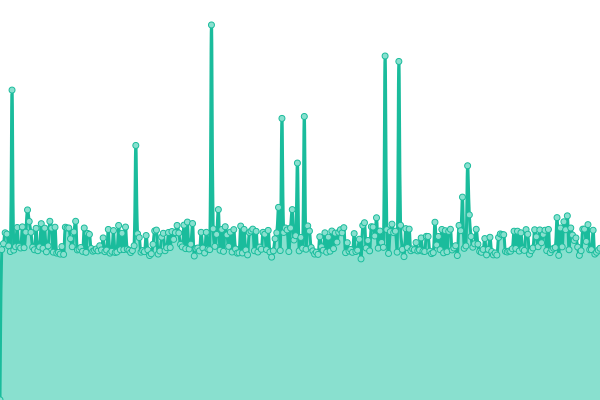 965ms
     
 | 

<a href="https://gelokatil.github.io/upptime-ceu/history/www-educacionporderecho-com">74.96%</a>
    

|  [100peliculashistoricas.ceu.es](https://100peliculashistoricas.ceu.es) | 🟩 Up | [100peliculashistoricas-ceu-es.yml](https://github.com/gelokatil/upptime-ceu/commits/HEAD/history/100peliculashistoricas-ceu-es.yml) | 

 2298ms
     
 | 

<a href="https://gelokatil.github.io/upptime-ceu/history/100peliculashistoricas-ceu-es">74.96%</a>
    

|  [observatorio-btl.uchceu.es](http://observatorio-btl.uchceu.es) | 🟩 Up | [observatorio-btl-uchceu-es.yml](https://github.com/gelokatil/upptime-ceu/commits/HEAD/history/observatorio-btl-uchceu-es.yml) | 

 1830ms
     
 | 

<a href="https://gelokatil.github.io/upptime-ceu/history/observatorio-btl-uchceu-es">74.96%</a>
    

|  [www.ceumedia.es](http://www.ceumedia.es) | 🟩 Up | [www-ceumedia-es.yml](https://github.com/gelokatil/upptime-ceu/commits/HEAD/history/www-ceumedia-es.yml) | 

 3477ms
     
 | 

<a href="https://gelokatil.github.io/upptime-ceu/history/www-ceumedia-es">74.97%</a>
    

|  [admisiontech.ceu.es](https://admisiontech.ceu.es) | 🟩 Up | [admisiontech-ceu-es.yml](https://github.com/gelokatil/upptime-ceu/commits/HEAD/history/admisiontech-ceu-es.yml) | 

 3074ms
     
 | 

<a href="https://gelokatil.github.io/upptime-ceu/history/admisiontech-ceu-es">73.36%</a>
    

|  [www.vividores.org](https://www.vividores.org) | 🟩 Up | [www-vividores-org.yml](https://github.com/gelokatil/upptime-ceu/commits/HEAD/history/www-vividores-org.yml) | 

 3718ms
     
 | 

<a href="https://gelokatil.github.io/upptime-ceu/history/www-vividores-org">74.97%</a>
    

|  [www.provuldig2.com](https://www.provuldig2.com) | 🟩 Up | [www-provuldig2-com.yml](https://github.com/gelokatil/upptime-ceu/commits/HEAD/history/www-provuldig2-com.yml) | 

 5261ms
     
 | 

<a href="https://gelokatil.github.io/upptime-ceu/history/www-provuldig2-com">74.97%</a>
    

|  [www.acdp.es](https://www.acdp.es) | 🟩 Up | [www-acdp-es.yml](https://github.com/gelokatil/upptime-ceu/commits/HEAD/history/www-acdp-es.yml) | 

 4634ms
     
 | 

<a href="https://gelokatil.github.io/upptime-ceu/history/www-acdp-es">74.97%</a>
    

|  [admisionuchinternacional.ceu.es](https://admisionuchinternacional.ceu.es) | 🟩 Up | [admisionuchinternacional-ceu-es.yml](https://github.com/gelokatil/upptime-ceu/commits/HEAD/history/admisionuchinternacional-ceu-es.yml) | 

 3978ms
     
 | 

<a href="https://gelokatil.github.io/upptime-ceu/history/admisionuchinternacional-ceu-es">100.00%</a>
    

|  [www.ceualumni.com](https://www.ceualumni.com) | 🟩 Up | [www-ceualumni-com.yml](https://github.com/gelokatil/upptime-ceu/commits/HEAD/history/www-ceualumni-com.yml) | 

 8683ms
     
 | 

<a href="https://gelokatil.github.io/upptime-ceu/history/www-ceualumni-com">75.52%</a>
    

|  [www.congreso.ceu.es](https://www.congreso.ceu.es) | 🟩 Up | [www-congreso-ceu-es.yml](https://github.com/gelokatil/upptime-ceu/commits/HEAD/history/www-congreso-ceu-es.yml) | 

 8082ms
     
 | 

<a href="https://gelokatil.github.io/upptime-ceu/history/www-congreso-ceu-es">100.00%</a>
    

|  [yolibre.org](https://yolibre.org) | 🟩 Up | [yolibre-org.yml](https://github.com/gelokatil/upptime-ceu/commits/HEAD/history/yolibre-org.yml) | 

 1010ms
     
 | 

<a href="https://gelokatil.github.io/upptime-ceu/history/yolibre-org">74.97%</a>
    

|  [www.aguadelceu.com](http://www.aguadelceu.com) | 🟩 Up | [www-aguadelceu-com.yml](https://github.com/gelokatil/upptime-ceu/commits/HEAD/history/www-aguadelceu-com.yml) | 

 965ms
     
 | 

<a href="https://gelokatil.github.io/upptime-ceu/history/www-aguadelceu-com">74.97%</a>
    

|  [comoenlos50.com](https://comoenlos50.com) | 🟩 Up | [comoenlos50-com.yml](https://github.com/gelokatil/upptime-ceu/commits/HEAD/history/comoenlos50-com.yml) | 

 830ms
     
 | 

<a href="https://gelokatil.github.io/upptime-ceu/history/comoenlos50-com">74.98%</a>
    

|  [www.lanuevacarteradelaministra.com](https://www.lanuevacarteradelaministra.com) | 🟩 Up | [www-lanuevacarteradelaministra-com.yml](https://github.com/gelokatil/upptime-ceu/commits/HEAD/history/www-lanuevacarteradelaministra-com.yml) | 

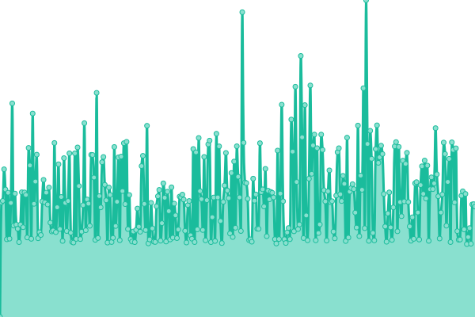 2250ms
     
 | 

<a href="https://gelokatil.github.io/upptime-ceu/history/www-lanuevacarteradelaministra-com">74.98%</a>
    

|  [www.ceuediciones.es](https://www.ceuediciones.es) | 🟩 Up | [www-ceuediciones-es.yml](https://github.com/gelokatil/upptime-ceu/commits/HEAD/history/www-ceuediciones-es.yml) | 

 4555ms
     
 | 

<a href="https://gelokatil.github.io/upptime-ceu/history/www-ceuediciones-es">74.98%</a>
    

|  [www.hubceu.es](https://www.hubceu.es) | 🟩 Up | [www-hubceu-es.yml](https://github.com/gelokatil/upptime-ceu/commits/HEAD/history/www-hubceu-es.yml) | 

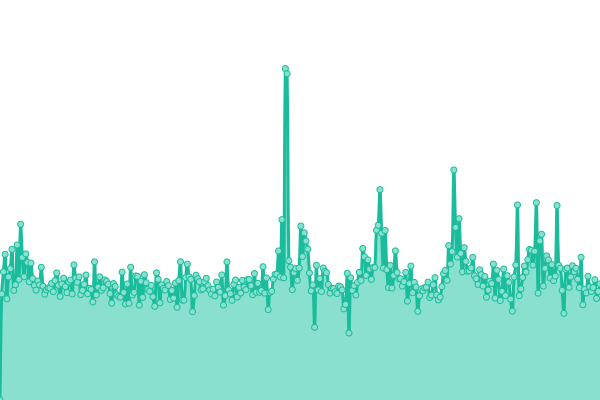 7519ms
     
 | 

<a href="https://gelokatil.github.io/upptime-ceu/history/www-hubceu-es">74.98%</a>
    

|  [www.graciasenunminuto.com](https://www.graciasenunminuto.com) | 🟩 Up | [www-graciasenunminuto-com.yml](https://github.com/gelokatil/upptime-ceu/commits/HEAD/history/www-graciasenunminuto-com.yml) | 

 3395ms
     
 | 

<a href="https://gelokatil.github.io/upptime-ceu/history/www-graciasenunminuto-com">74.98%</a>
    

|  [www.pormuchasrazones.es](https://www.pormuchasrazones.es) | 🟩 Up | [www-pormuchasrazones-es.yml](https://github.com/gelokatil/upptime-ceu/commits/HEAD/history/www-pormuchasrazones-es.yml) | 

 2200ms
     
 | 

<a href="https://gelokatil.github.io/upptime-ceu/history/www-pormuchasrazones-es">74.99%</a>
    

|  [www.noticiario1936.com](http://www.noticiario1936.com) | 🟩 Up | [www-noticiario1936-com.yml](https://github.com/gelokatil/upptime-ceu/commits/HEAD/history/www-noticiario1936-com.yml) | 

 353ms
     
 | 

<a href="https://gelokatil.github.io/upptime-ceu/history/www-noticiario1936-com">74.99%</a>
    

|  [www.bibliotecaceu.es](http://www.bibliotecaceu.es) | 🟩 Up | [www-bibliotecaceu-es.yml](https://github.com/gelokatil/upptime-ceu/commits/HEAD/history/www-bibliotecaceu-es.yml) | 

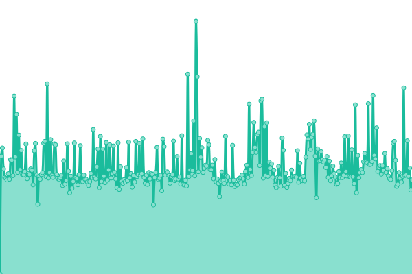 3100ms
     
 | 

<a href="https://gelokatil.github.io/upptime-ceu/history/www-bibliotecaceu-es">74.99%</a>
    

|  [haleoalicante.ceu.es](https://haleoalicante.ceu.es) | 🟥 Down | [haleoalicante-ceu-es.yml](https://github.com/gelokatil/upptime-ceu/commits/HEAD/history/haleoalicante-ceu-es.yml) | 

 1851ms
     
 | 

<a href="https://gelokatil.github.io/upptime-ceu/history/haleoalicante-ceu-es">74.99%</a>
    

|  [innovationweek.ceu.es](https://innovationweek.ceu.es) | 🟩 Up | [innovationweek-ceu-es.yml](https://github.com/gelokatil/upptime-ceu/commits/HEAD/history/innovationweek-ceu-es.yml) | 

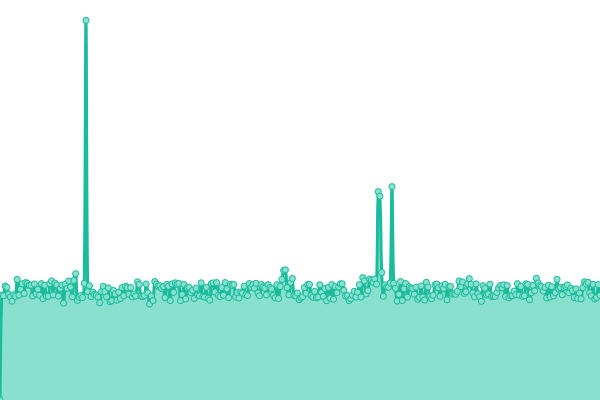 943ms
     
 | 

<a href="https://gelokatil.github.io/upptime-ceu/history/innovationweek-ceu-es">74.99%</a>
    

|  [www.fundacionaho.es](https://www.fundacionaho.es) | 🟩 Up | [www-fundacionaho-es.yml](https://github.com/gelokatil/upptime-ceu/commits/HEAD/history/www-fundacionaho-es.yml) | 

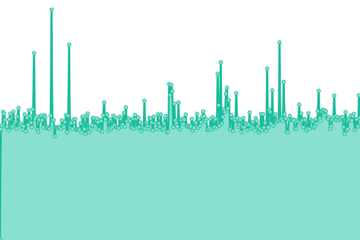 884ms
     
 | 

<a href="https://gelokatil.github.io/upptime-ceu/history/www-fundacionaho-es">75.00%</a>
    

|  [francescoeconomy.ceu.es](https://francescoeconomy.ceu.es) | 🟩 Up | [francescoeconomy-ceu-es.yml](https://github.com/gelokatil/upptime-ceu/commits/HEAD/history/francescoeconomy-ceu-es.yml) | 

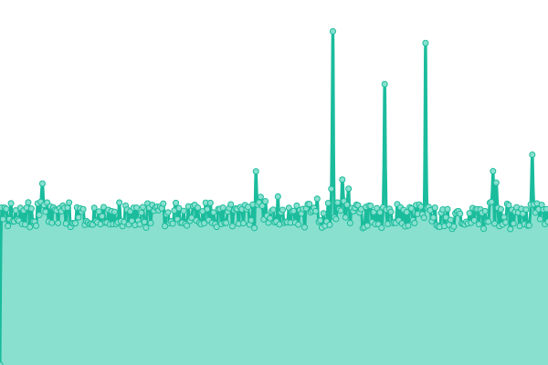 847ms
     
 | 

<a href="https://gelokatil.github.io/upptime-ceu/history/francescoeconomy-ceu-es">75.00%</a>
    

|  [moodlecmtp.ceu.es](https://moodlecmtp.ceu.es) | 🟩 Up | [moodlecmtp-ceu-es.yml](https://github.com/gelokatil/upptime-ceu/commits/HEAD/history/moodlecmtp-ceu-es.yml) | 

 1926ms
     
 | 

<a href="https://gelokatil.github.io/upptime-ceu/history/moodlecmtp-ceu-es">75.00%</a>
    

|  [iehistoricos.ceu.es](https://iehistoricos.ceu.es) | 🟩 Up | [iehistoricos-ceu-es.yml](https://github.com/gelokatil/upptime-ceu/commits/HEAD/history/iehistoricos-ceu-es.yml) | 

 5489ms
     
 | 

<a href="https://gelokatil.github.io/upptime-ceu/history/iehistoricos-ceu-es">75.00%</a>
    

|  [institutodemocracia.ceu.es](https://institutodemocracia.ceu.es) | 🟩 Up | [institutodemocracia-ceu-es.yml](https://github.com/gelokatil/upptime-ceu/commits/HEAD/history/institutodemocracia-ceu-es.yml) | 

 3323ms
     
 | 

<a href="https://gelokatil.github.io/upptime-ceu/history/institutodemocracia-ceu-es">75.00%</a>
    

|  [revistascientificas.uspceu.com](https://revistascientificas.uspceu.com) | 🟩 Up | [revistascientificas-uspceu-com.yml](https://github.com/gelokatil/upptime-ceu/commits/HEAD/history/revistascientificas-uspceu-com.yml) | 

 1124ms
     
 | 

<a href="https://gelokatil.github.io/upptime-ceu/history/revistascientificas-uspceu-com">100.00%</a>
    

|  [cembio.uspceu.es](https://cembio.uspceu.es) | 🟩 Up | [cembio-uspceu-es.yml](https://github.com/gelokatil/upptime-ceu/commits/HEAD/history/cembio-uspceu-es.yml) | 

 3941ms
     
 | 

<a href="https://gelokatil.github.io/upptime-ceu/history/cembio-uspceu-es">75.02%</a>
    

|  [blog.ciclosformativosceu.es](https://blog.ciclosformativosceu.es) | 🟩 Up | [blog-ciclosformativosceu-es.yml](https://github.com/gelokatil/upptime-ceu/commits/HEAD/history/blog-ciclosformativosceu-es.yml) | 

 4014ms
     
 | 

<a href="https://gelokatil.github.io/upptime-ceu/history/blog-ciclosformativosceu-es">75.01%</a>
    

|  [presslext.ceu.es](https://presslext.ceu.es) | 🟩 Up | [presslext-ceu-es.yml](https://github.com/gelokatil/upptime-ceu/commits/HEAD/history/presslext-ceu-es.yml) | 

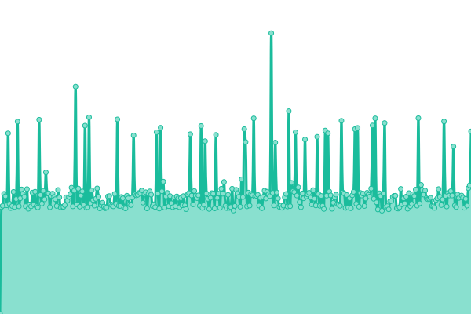 714ms
     
 | 

<a href="https://gelokatil.github.io/upptime-ceu/history/presslext-ceu-es">75.02%</a>
    

|  [citeceu.ceu.es](https://citeceu.ceu.es) | 🟩 Up | [citeceu-ceu-es.yml](https://github.com/gelokatil/upptime-ceu/commits/HEAD/history/citeceu-ceu-es.yml) | 

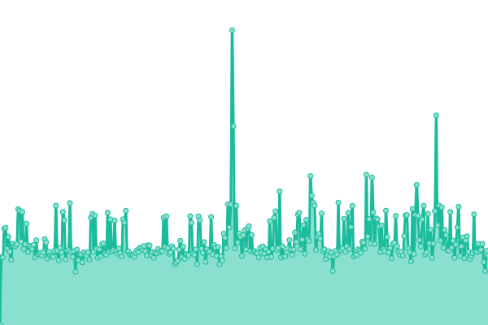 2506ms
     
 | 

<a href="https://gelokatil.github.io/upptime-ceu/history/citeceu-ceu-es">75.02%</a>
    

|  [congreso.provuldig.com](http://congreso.provuldig.com) | 🟩 Up | [congreso-provuldig-com.yml](https://github.com/gelokatil/upptime-ceu/commits/HEAD/history/congreso-provuldig-com.yml) | 

 1207ms
     
 | 

<a href="https://gelokatil.github.io/upptime-ceu/history/congreso-provuldig-com">75.02%</a>
    

|  [www.educaceu.es](http://www.educaceu.es) | 🟩 Up | [www-educaceu-es.yml](https://github.com/gelokatil/upptime-ceu/commits/HEAD/history/www-educaceu-es.yml) | 

 1481ms
     
 | 

<a href="https://gelokatil.github.io/upptime-ceu/history/www-educaceu-es">75.03%</a>
    

|  [manage.ceu.es](https://manage.ceu.es) | 🟩 Up | [manage-ceu-es.yml](https://github.com/gelokatil/upptime-ceu/commits/HEAD/history/manage-ceu-es.yml) | 

 678ms
     
 | 

<a href="https://gelokatil.github.io/upptime-ceu/history/manage-ceu-es">75.03%</a>
    

|  [www.encuentrofamiliasceu.com](https://www.encuentrofamiliasceu.com) | 🟥 Down | [www-encuentrofamiliasceu-com.yml](https://github.com/gelokatil/upptime-ceu/commits/HEAD/history/www-encuentrofamiliasceu-com.yml) | 

 0ms
     
 | 

<a href="https://gelokatil.github.io/upptime-ceu/history/www-encuentrofamiliasceu-com">75.03%</a>
    

|  [rss.uchceu.es](https://rss.uchceu.es) | 🟩 Up | [rss-uchceu-es.yml](https://github.com/gelokatil/upptime-ceu/commits/HEAD/history/rss-uchceu-es.yml) | 

 1887ms
     
 | 

<a href="https://gelokatil.github.io/upptime-ceu/history/rss-uchceu-es">75.03%</a>
    

|  [intranet.ceu.es](https://intranet.ceu.es/loginceu/Login.aspx) | 🟩 Up | [intranet-ceu-es.yml](https://github.com/gelokatil/upptime-ceu/commits/HEAD/history/intranet-ceu-es.yml) | 

 525ms
     
 | 

<a href="https://gelokatil.github.io/upptime-ceu/history/intranet-ceu-es">100.00%</a>
    

|  [www.ceucyl.com](https://www.ceucyl.com) | 🟩 Up | [www-ceucyl-com.yml](https://github.com/gelokatil/upptime-ceu/commits/HEAD/history/www-ceucyl-com.yml) | 

 3496ms
     
 | 

<a href="https://gelokatil.github.io/upptime-ceu/history/www-ceucyl-com">75.04%</a>
    

|  [blogs.uao.es](https://blogs.uao.es) | 🟩 Up | [blogs-uao-es.yml](https://github.com/gelokatil/upptime-ceu/commits/HEAD/history/blogs-uao-es.yml) | 

 2948ms
     
 | 

<a href="https://gelokatil.github.io/upptime-ceu/history/blogs-uao-es">75.04%</a>
    

|  [aulanews.uao.es](https://aulanews.uao.es) | 🟩 Up | [aulanews-uao-es.yml](https://github.com/gelokatil/upptime-ceu/commits/HEAD/history/aulanews-uao-es.yml) | 

 4657ms
     
 | 

<a href="https://gelokatil.github.io/upptime-ceu/history/aulanews-uao-es">75.04%</a>
    

|  [tuestrellapolar.uaoceu.es](https://tuestrellapolar.uaoceu.es) | 🟩 Up | [tuestrellapolar-uaoceu-es.yml](https://github.com/gelokatil/upptime-ceu/commits/HEAD/history/tuestrellapolar-uaoceu-es.yml) | 

 846ms
     
 | 

<a href="https://gelokatil.github.io/upptime-ceu/history/tuestrellapolar-uaoceu-es">75.04%</a>
    

|  [enquestes.uao.es](https://enquestes.uao.es) | 🟥 Down | [enquestes-uao-es.yml](https://github.com/gelokatil/upptime-ceu/commits/HEAD/history/enquestes-uao-es.yml) | 

 0ms
     
 | 

<a href="https://gelokatil.github.io/upptime-ceu/history/enquestes-uao-es">75.04%</a>
    

|  [feriainternacional.ceu.es](https://feriainternacional.ceu.es) | 🟩 Up | [feriainternacional-ceu-es.yml](https://github.com/gelokatil/upptime-ceu/commits/HEAD/history/feriainternacional-ceu-es.yml) | 

 948ms
     
 | 

<a href="https://gelokatil.github.io/upptime-ceu/history/feriainternacional-ceu-es">75.05%</a>
    

|  [500pacifico.uaoceu.es](https://500pacifico.uaoceu.es) | 🟩 Up | [500pacifico-uaoceu-es.yml](https://github.com/gelokatil/upptime-ceu/commits/HEAD/history/500pacifico-uaoceu-es.yml) | 

 3109ms
     
 | 

<a href="https://gelokatil.github.io/upptime-ceu/history/500pacifico-uaoceu-es">75.05%</a>
    

|  [www.ceudigital.com](https://www.ceudigital.com) | 🟩 Up | [www-ceudigital-com.yml](https://github.com/gelokatil/upptime-ceu/commits/HEAD/history/www-ceudigital-com.yml) | 

 2267ms
     
 | 

<a href="https://gelokatil.github.io/upptime-ceu/history/www-ceudigital-com">75.05%</a>
    

|  [admisionuch.ceu.es](https://admisionuch.ceu.es) | 🟩 Up | [admisionuch-ceu-es.yml](https://github.com/gelokatil/upptime-ceu/commits/HEAD/history/admisionuch-ceu-es.yml) | 

 1353ms
     
 | 

<a href="https://gelokatil.github.io/upptime-ceu/history/admisionuch-ceu-es">75.05%</a>
    

|  [blog.uchceu.es](https://blog.uchceu.es) | 🟩 Up | [blog-uchceu-es.yml](https://github.com/gelokatil/upptime-ceu/commits/HEAD/history/blog-uchceu-es.yml) | 

 903ms
     
 | 

<a href="https://gelokatil.github.io/upptime-ceu/history/blog-uchceu-es">100.00%</a>
    

|  [medios.uchceu.es](https://medios.uchceu.es) | 🟩 Up | [medios-uchceu-es.yml](https://github.com/gelokatil/upptime-ceu/commits/HEAD/history/medios-uchceu-es.yml) | 

 2084ms
     
 | 

<a href="https://gelokatil.github.io/upptime-ceu/history/medios-uchceu-es">74.03%</a>
    

|  [3d.ceu.es](https://3d.ceu.es) | 🟩 Up | [3d-ceu-es.yml](https://github.com/gelokatil/upptime-ceu/commits/HEAD/history/3d-ceu-es.yml) | 

 1872ms
     
 | 

<a href="https://gelokatil.github.io/upptime-ceu/history/3d-ceu-es">75.06%</a>
    

|  [www.goliads.com](https://www.goliads.com) | 🟩 Up | [www-goliads-com.yml](https://github.com/gelokatil/upptime-ceu/commits/HEAD/history/www-goliads-com.yml) | 

 8374ms
     
 | 

<a href="https://gelokatil.github.io/upptime-ceu/history/www-goliads-com">92.68%</a>
    

|  [educationtalks.es](https://educationtalks.es) | 🟩 Up | [educationtalks-es.yml](https://github.com/gelokatil/upptime-ceu/commits/HEAD/history/educationtalks-es.yml) | 

 3569ms
     
 | 

<a href="https://gelokatil.github.io/upptime-ceu/history/educationtalks-es">75.06%</a>
    

|  [www.ceule.es](https://www.ceule.es) | 🟩 Up | [www-ceule-es.yml](https://github.com/gelokatil/upptime-ceu/commits/HEAD/history/www-ceule-es.yml) | 

 3384ms
     
 | 

<a href="https://gelokatil.github.io/upptime-ceu/history/www-ceule-es">75.07%</a>
    

|  [emplea.ceu.es](https://emplea.ceu.es) | 🟩 Up | [emplea-ceu-es.yml](https://github.com/gelokatil/upptime-ceu/commits/HEAD/history/emplea-ceu-es.yml) | 

 673ms
     
 | 

<a href="https://gelokatil.github.io/upptime-ceu/history/emplea-ceu-es">75.07%</a>
    

|  [neurofan.ceu.es](https://neurofan.ceu.es) | 🟩 Up | [neurofan-ceu-es.yml](https://github.com/gelokatil/upptime-ceu/commits/HEAD/history/neurofan-ceu-es.yml) | 

 673ms
     
 | 

<a href="https://gelokatil.github.io/upptime-ceu/history/neurofan-ceu-es">75.07%</a>
    

|  [Chico RedIRIS](130.206.1.3) | 🟩 Up | [chico-red-iris.yml](https://github.com/gelokatil/upptime-ceu/commits/HEAD/history/chico-red-iris.yml) | 

 110ms
     
 | 

<a href="https://gelokatil.github.io/upptime-ceu/history/chico-red-iris">100.00%</a>
    

|  [Sun RedIRIS](130.206.1.2) | 🟩 Up | [sun-red-iris.yml](https://github.com/gelokatil/upptime-ceu/commits/HEAD/history/sun-red-iris.yml) | 

 119ms
     
 | 

<a href="https://gelokatil.github.io/upptime-ceu/history/sun-red-iris">100.00%</a>
    

|  [NS CEU](193.146.228.3) | 🟩 Up | [ns-ceu.yml](https://github.com/gelokatil/upptime-ceu/commits/HEAD/history/ns-ceu.yml) | 

 111ms
     
 | 

<a href="https://gelokatil.github.io/upptime-ceu/history/ns-ceu">100.00%</a>
    

|  [VPN CEU](vpn.ceu.es) | 🟩 Up | [vpn-ceu.yml](https://github.com/gelokatil/upptime-ceu/commits/HEAD/history/vpn-ceu.yml) | 

 119ms
     
 | 

<a href="https://gelokatil.github.io/upptime-ceu/history/vpn-ceu">100.00%</a>
    

<!--end: status pages-->

[**Visit our status website →**](https://gelokatil.github.io/upptime-ceu)

## 📄 License

- Powered by: [Upptime](https://github.com/upptime/upptime)
- Code: [MIT](./LICENSE) © [Gelo](https://gelokatil.github.io/upptime-ceu)
- Data in the `./history` directory: [Open Database License](https://opendatacommons.org/licenses/odbl/1-0/)
